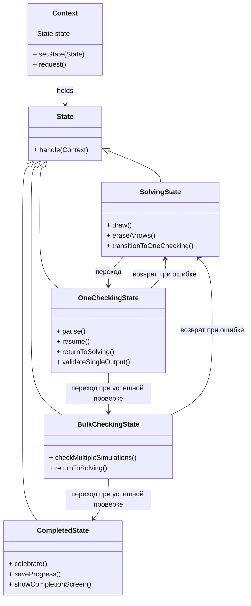

Разница в мотивах игрока:
sandbox - свобода(можно поделиться, несильно), для себя[нет паттерных стрелок]
editor - загадка(можно поделиться, сильно), для других[есть все стрелки]
# Mode: Песочница(Sandbox)

|Состояния уровня|Возможности игрока|Возможности системы|
|---|---|---|

# Mode: Уровень(Level)

|Состояния уровня|Возможности игрока|Возможности системы|
|---|---|---|
|1. solving|• рисование из заданного набора кистей  •  стирание свои стрелки  •  переход в состояние one checking|• описываются возможностями игрока|
|2. one checking|• можно ставить и снимать с паузы(paused)  •  возможность вернуться в solving|• единичный просчёт симуляции и валидация для каждого output(isValid)  • при валидности всех output(isChecked) уровень проверен  • при неудачной валидации возвращение в solving|
|3. bulk checking|• ничего нельзя делать|• просчёт нескольких симуляций без визуального ряда и проверка каждой симуляции(isChecked)  •  при удачной проверке всех симуляций(isCompleted) уровень завершён  • при неудачной проверке возвращение в solving|
|4. completed|• насладись победой|• записать данные о прохождении в сервер  • показ экран успешного завершения|

# Mode: Редактор(Editor)
|Состояния уровня|Возможности игрока|Возможности системы|
|---|---|---|

TODO: 
1. написать getOutputArrows(хэшмап)
2. сделать StateBulkChecking
3. сделать StateCompleted
